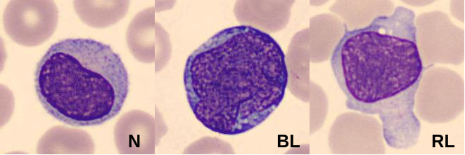

```{r setup, include=FALSE}
knitr::opts_chunk$set(echo = TRUE)
```

## Parcial 2, Punto 4

En este ejercicio se tendrá que analizar un dataset (inédito, no está en internet), sobre diversos parámetros determinados a partir de imágenes digitales de células de la sangre periférica, relacionadas con pacientes sanos, pacientes con leucemias agudas y pacientes con infecciones víricas. 


INSERTE LA RUTA DEL DIRECTORIO DONDE SE ENCUENTRAN LOS DATOS EN LA VARIABLE `directorio`.
```{r Directorio}
directorio = "data"
archivo = paste(directorio, "malignant_cells2.csv", sep ='/')

```

A continuación se lee el dataset `malignant_cells2.csv`

```{r dataset}
# INSERTE EL CODIGO AQUI
df = read.csv(file=archivo)
```

Puede inspeccionar el dataset utilizando `head(df)` o simplemente haciendo click en en la variable `df` en la ventana de Enviroment. 

```{r}
dim(df)
```
Este dataset contiene un total de 1000 células y 216 parámetros. La columna que describe el tipo de célula es `tipoCelula`. Los tipos y el número de células por tipo se pueden conocer ejecutando:

```{r}
table(df$tipoCelula)
```

La siguiente figura muestra un ejemplo para cada tipo de célula analizadas. 



A continuación se describen las abreviaciones de cada clase:

- N: son linfocitos normales, presentes tanto en pacientes sanos como enfermos.
- BL: son blastos un tipo de célula que aparece en la sangre periférica cuando el paciente tiene una leucemia aguda.
- RL: son linfocitos reactivos, que aparecen cuando el paciente padece una infección vírica.

El descriptor que se va a analizar cómo ejemplo es la `relación nucleo-célula`, un parámetro que se define como la relación entre el área del núcleo y el área de toda la célula. Sin embargo, **debe seleccionar el descriptor de acuerdo a sus dos últimos dígitos de su cédula** como muestra la siguiente tabla:

Descriptor        | 2 últimos dígitos de CC | Descripción 
----------------- | ----------------------- | -----------
NCellratio        | Ejemplo                 | Relacion nucleo-celula
RBCproximity      | 24                      | Proximidad de los globulos rojos
Perimeter_cel     | 68                      | Perimetro de la celula
R_S1_Skewness_cel | 26                      | Asimetria de la componente roja en la celula
G_S1_Std_cel      | 73                      | Desviacion estandar de la componente verde en la celula
Area_cel          | 12                      | Area de la celula
Pgra_R_mean_cel   | 39                      | media de la curva pseudo-granulometrica de la componente roja en la celula
EquivDiameter_nuc | 63                      | Diametro equivalente del nucleo
G_S2_Energy_nuc   | 28                      | Energia (orden 2) de la componente verde del nucleo

#### A continuación se grafica un boxplot para conocer y comparar las distribuciones del descriptor respecto a cada tipo de célula (y sus medias). 

```{r}
descriptor =  "RBCproximity" 

boxplot(as.formula(paste(descriptor, '~tipoCelula')), # Descriptor vs tipoCelula para mostrar tres boxplots, x cada cel
        data=df,
        outline=FALSE, # No muestra outliers,
        main="Boxplots por cada tipo de célula de un descriptor",
        col="pink",
        border="red"
        )

means <- tapply(df[[descriptor]], df$tipoCelula,mean) #Halla las medias 
points(means,col="blue",pch=18) # Grafica cada media como un punto azul
```


#### Y ahora graficamos las distribuciones (ajustadas y aproximadas) del descriptor para cada tipo de célula.
```{r, include=FALSE}
if (!require('sm')) install.packages('sm') # Instala el paquete Smoothing Methods for Nonparametric Regression and Density Estimation 
```

```{r}
# Compara las distribuciones para los tres tipos de célula
library(sm)

# crea etiquetas
tipo.f <- factor(df$tipoCelula)

# grafica densidades
sm.density.compare(df[[descriptor]], df$tipoCelula)
title(main="Distribuciones por tipo de célula")

# anade leyenda
colfill<-c(2:(2+length(levels(tipo.f))))
legend('topright', levels(tipo.f),fill=colfill)
```
Observe que las distribuciones son aproximadamente normales (con varianzas desiguales, pero supondremos que son iguales).

## PUNTO A DESARROLLAR PARA EL PARCIAL

Las gráficas anteriores muestran que hay una diferencia substancial entre las medias del parámetro celular de la relación núcleo-célula para los blastos y los linfocitos reactivos, mientras que las medias casi no difieren para los linfocitos normales y los blastos. Tome una muestra aleatoria de $n=35$ sobre el dataframe y compruebe estadísticamente (sobre la muestra) mediante pruebas de hipótesis las afirmaciones anteriores (es decir, saque una conclusión a través de los valores-p de dichas pruebas).

#### Formulas básicas para la prueba
Recuerde que las pruebas con muestras pequeñas para comparar dos medias poblacionales suponen que son muestras independientes tomadas de distribuciones normales con varianzas iguales $\sigma_1^2 = \sigma_2^2$, con el siguiente planteamiento (para la alternativa de dos colas): 
$$
H_0: \mu_1-\mu_2 = D_0 \\
H_a: \mu_1-\mu_2 \neq D_0
$$
Con el estadístico de prueba dado por: $T = \dfrac{\bar{Y_1}-\bar{Y_2}-D_0}{S_p \sqrt{\frac{1}{n_1}+\frac{1}{n_2}}}$, donde $S_p = \sqrt{\dfrac{(n_1-1)S_1^2+(n_2-1)S_2^2}{n_1+n_2-2}}$.

La región de rechazo para la alternativa de dos colas es: $|t|>t_{\alpha/2}$.

En lo anterior, $P(T>t_\alpha)=\alpha$ y el grado de libertad es $\nu=n_1+n_2-2$.

A continuación se fija la semilla aleatoria para reproducibilidad. Cada grupo debe contener al menos 3 elementos, en caso contrario cambie el número de la semilla (que está en 2 ).

```{r}

# set.seed(43) # Se fija la semilla para reproducibilidad
set.seed(2, kind="Mersenne-Twister", normal.kind = "Inversion")

dfsample = df[sample(nrow(df), 35),] # selecciona una muestra aleatoria de tamano 35
table(dfsample$tipoCelula) # Muestra las proporciones para cada tipo de celula

```

#### PLANTILLA A LLENAR PARA SOLUCIONAR EL PUNTO (diferencia entre medias de RL y BL)
```{r}
# INSERTE EL CODIGO PARA EL MUESTREO DE CADA TIPO DE CELULA REFERENTE AL DESCRIPTOR
datos_RL = dfsample[dfsample$tipoCelula == 'RL', descriptor] # Se elecciona solo el tipo de celula RL y el descriptor 
datos_BL = dfsample[dfsample$tipoCelula == "BL" , descriptor]
         
# CALCULE LA DESVIACION ESTANDAR Y EL TAMANO DE LA MUESTRA DEL PRIMER TIPO DE CELULA        
S1 = sqrt(var(datos_RL))
n1 = length(datos_RL)

# CALCULE LA DESVIACION ESTANDAR Y EL TAMANO DE LA MUESTRA DEL SEGUNDO TIPO DE CELULA 
S2 = sqrt(var(datos_BL))
n2 =length(datos_BL)

# CALCULE LA DESVIACION ESTANDAR EQUIVALENTE (SP)
SP = sqrt(  (((n1-1)*S1) +((n2-1)*S2))/ (n1+n2-2)      )


# CALCULE EL ESTADISTICO 
t  = (mean(datos_RL) - mean(datos_BL) ) / (SP* (sqrt (1/n1 + 1/n2)))

# CALCULE EL VALOR-P
valor_p = qf(0.025 , n1-1 , n2-1 , lower.tail = TRUE)
# valor_p
```

### CONCLUSION SOBRE LAS DIFERENCIAS ENTRE LAS MEDIAS DE LA RELACION NUCLEO/CELULA SOBRE RL Y BL ###

COLOQUE AQUI LA RESPECTIVA CONCLUSION

--- con alpha = 0.95 se tiene que t no está en la region de rechazo , por lo tanto es correcto afirmar que la relacion nucleo/celula de las celulas RL es mayor a las BL con un 95% de certeza

#### PLANTILLA A LLENAR PARA SOLUCIONAR EL PUNTO (diferencia entre medias de N y BL)

```{r}
# INSERTE EL CODIGO PARA EL MUESTREO DE CADA TIPO DE CELULA REFERENTE AL DESCRIPTOR
datos_N = dfsample[dfsample$tipoCelula == 'N', descriptor]
datos_BL = dfsample[dfsample$tipoCelula == 'BL', descriptor]
        
# CALCULE LA DESVIACION ESTANDAR Y EL TAMANO DE LA MUESTRA DEL PRIMER TIPO DE CELULA        
S3 = sqrt(var (datos_N))
n3 = length((datos_N))

# CALCULE LA DESVIACION ESTANDAR Y EL TAMANO DE LA MUESTRA DEL SEGUNDO TIPO DE CELULA 
# S2 ESTO YA ESTA CALCULADO PREVIAMENTE
# n2 =

# CALCULE LA DESVIACION ESTANDAR EQUIVALENTE (SP)
SP2 = SP = sqrt(  (((n3-1)*S3) +((n2-1)*S2))/ (n3+n2-2)      )


# CALCULE EL ESTADISTICO 
t2  =( mean(datos_BL) - mean(datos_N)  ) / (SP2* (sqrt (1/n3 + 1/n2)))


# CALCULE EL VALOR-P
valor_p2 =  qf(0.025 , n2-1 , n3-1 , lower.tail = TRUE)

# valor_p
```
### CONCLUSION SOBRE LAS DIFERENCIAS ENTRE LAS MEDIAS DE LA RELACION NUCLEO/CELULA SOBRE N Y BL 


#COLOQUE AQUI LA RESPECTIVA CONCLUSION
#note que t2 > valor_p2 , por lo tanto no está en la región de rechazo luego es posible afirmar que la media de datos_N nucleo/celula es mayor que la media de datos_BL con un 95% de probabilidad